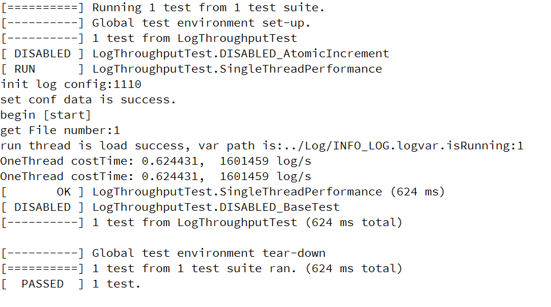

# aLog 模块文档

`aLog` 开发日志

日志介绍：

使用异步输入输出，格式 `format` 匹配字符串，自定义内存块，以缓冲队列存储信息，使用 `C++11` 对系统进行匹配（考虑到可能某些生产环境下并不支持高版本 C++）

### 功能日志

- 宏功能接口（已完成）
- 控制台输出（已完成）
- 输出日志文件（已完成）
- 文件设置接口（已完成）
    - 绝对路径匹配
    - 相对路径匹配
- 线程安全（已完成）

单文件写入数据量如下：

 性能测试 | 测试值 |
| ----------- | ----------- |
| 写入速度（debug模式） | 70w logs/s~80w logs/s |
| 写入速度（release模式）| 164w logs/s |
| ns/op（release模式）| 4.2k ns/op |

如下图写入速度测试（release模式）：

如下图 `ns/op` 测试（release模式）

注：当使用多个文件同时写入，会导致性能下降